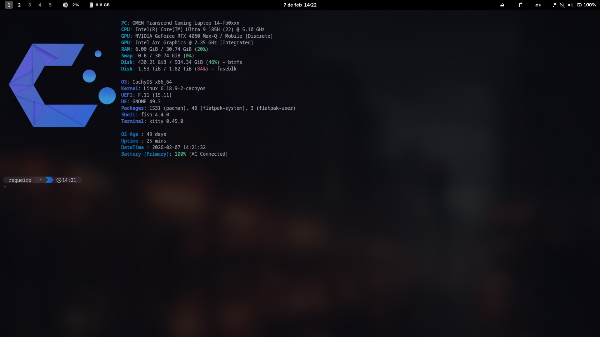
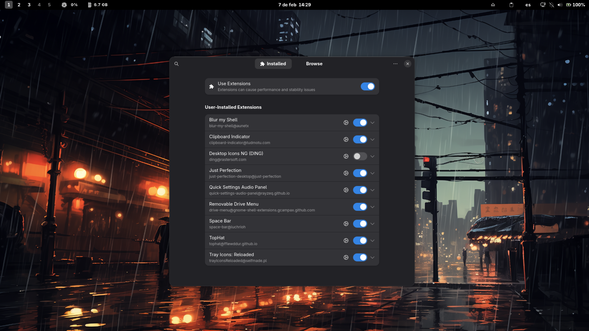
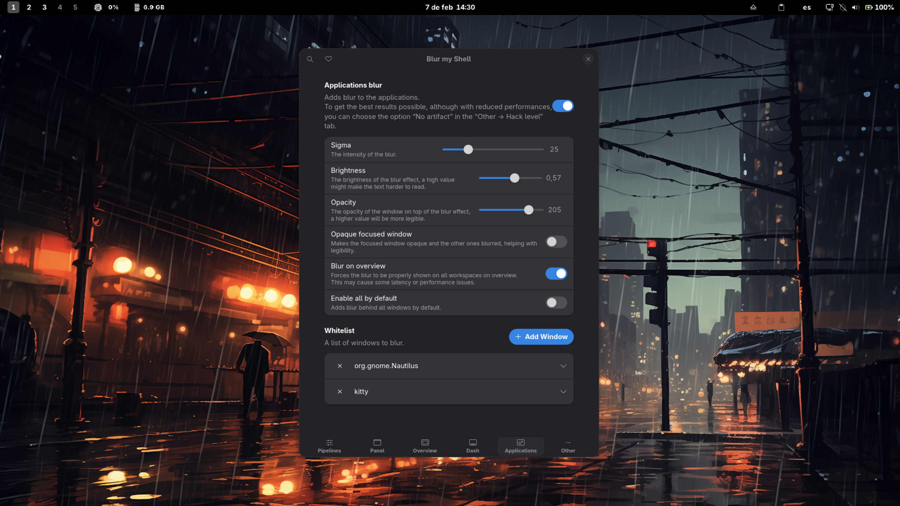
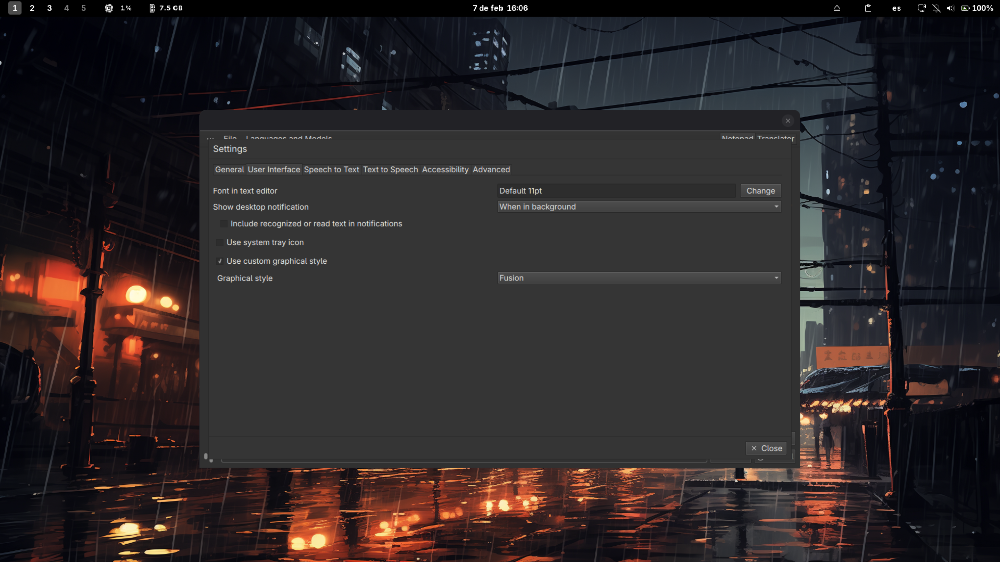

# 🚀 MyCachyOSDotFiles

<div align="center">




</div>

<br>

**Custom dotfiles and system tweaks for CachyOS** (Arch-based).

This setup is **specifically tailored for CachyOS**, though many configurations will work on **other Arch-based distributions**. Some tools and configurations are universal. I even use most of these tools on other Fedora-based systems, so this guide can serve as a reference for **any Arch-based GNOME setup**.

With this setup, you can:

* ✨ Enhance your **GNOME desktop**
* 💻 Improve your **terminal experience**
* 🎮 Optimize your system for **gaming**
* 🌐 Set up **remote access**
* 📝 Support **language learning**
* 🎇 **Many** other goodies

💡 **Tip:** You're free to pick and choose the tools, configs, and themes you like. This is my personal setup guide—tweak anything, swap things out, or follow it exactly as I do. **Make it your own!**

---

## 📖 Table of Contents

- [🚀 Quick Start](#-quick-start)
- [💻 Core Setup](#-core-setup)
  - [GNOME Desktop Environment](#-gnome-desktop-environment)
  - [Terminal & CLI Tools](#️-terminal--cli-tools)
- [⚙️ System & Hardware](#️-system--hardware)
  - [System Optimization & Monitoring](#-system-optimization--monitoring)
  - [Hardware & Storage](#-hardware--storage)
- [📦 Software & Applications](#-software--applications)
  - [Development & Productivity](#-development--productivity)
  - [Utilities, Media & Language](#-utilities-media--language)
- [🌐 Connectivity](#-connectivity)
- [ℹ️ Reference](#️-reference)

---

## 🚀 Quick Start

Get up and running quickly with these steps:

1. **Clone the repository:**
   ```bash
   git clone https://github.com/MiguelRegueiro/MyCachyOSDotFiles
   cd MyCachyOSDotFiles
   ```

2. **Install prerequisite tools:**
   ```bash
   sudo pacman -S gnome-tweaks
   ```

3. **Run the automated setup script for window and workspace shortcuts:**
   ```bash
   ./Scripts/set_window_workspace_shortcuts.sh
   ```

4. **Install themes and icons:**
   ```bash
   mkdir -p ~/.local/share/icons
   cp -r icons/* ~/.local/share/icons/
   ```

5. **Copy configuration files:**
   ```bash
   cp -r kitty/ ~/.config/
   cp -r fish/ ~/.config/
   cp -r fastfetch/ ~/.config/
   cp starship.toml ~/.config/
   cp -r mpv/ ~/.config/
   ```

---

## 💻 Core Setup

### ✨ GNOME Desktop Environment

#### 🛠️ Automated Configuration Script

The easiest way to configure all GNOME settings, keyboard shortcuts, and behavior fixes is to use the included automation script:

```bash
./Scripts/set_window_workspace_shortcuts.sh
```

This script will automatically configure:
- Traditional Alt+Tab behavior (switching individual windows, not grouped by app)
- Show battery percentage in the top bar
- Workspace management shortcuts (Super+1-5 to switch, Super+Shift+1-5 to move windows)
- Custom application launchers (Super+E, Super+Enter, etc.)
- Window closing shortcut (Super+Q)
- And more GNOME optimizations

<details>
<summary><h4>♣️ Manual Configuration & Custom Shortcuts (Optional)</h4></summary>

If you prefer to configure settings manually, here are the key `gsettings` commands:

**Restore traditional Alt+Tab (individual windows, not grouped by app):**
```bash
gsettings set org.gnome.desktop.wm.keybindings switch-windows "['<Alt>Tab']"
gsettings set org.gnome.desktop.wm.keybindings switch-windows-backward "['<Shift><Alt>Tab']"
gsettings set org.gnome.desktop.wm.keybindings switch-applications "[]"
gsettings set org.gnome.desktop.wm.keybindings switch-applications-backward "[]"
```

**Show battery percentage in top bar:**
```bash
gsettings set org.gnome.desktop.interface show-battery-percentage true
```

The script sets up these convenient keyboard shortcuts. To set them manually, go to **Settings → Keyboard → View and Customize Shortcuts → Custom Shortcuts** and add them.

| Shortcut       | Application          | Command                          |
|----------------|----------------------|----------------------------------|
| `Super + E`    | Files (Nautilus)     | `nautilus --new-window`          |
| `Super + Enter`| Kitty Terminal       | `kitty`                          |
| `Super + R`    | Btop                 | `kitty -e btop`                  |
| `Super + B`    | Zen Browser          | `flatpak run app.zen_browser.zen`|
| `Super + F9`   | OCR (NormCap)        | `/usr/bin/flatpak run com.github.dynobo.normcap`|
| `Super + Q`    | Close Active Window  | Closes the currently focused window |

</details>

#### 🎨 Visual Style

**Prerequisites:**
1. Install `gnome-tweaks`: `sudo pacman -S gnome-tweaks`
2. Enable the **User Themes** extension in the `gnome-extensions-app`.

**Included Themes:**
All themes are in the `icons/` directory.
| Component  | Theme                 | Installation                               |
| ---------- | --------------------- | ------------------------------------------ |
| Icon Theme | MacTahoe              | Copy to `~/.local/share/icons/`            |
| Cursor     | Bibata-Modern-Classic | Copy to `~/.local/share/icons/`            |

To install all at once:
```bash
cp -r icons/* ~/.local/share/icons/
```
After installation, select your themes in **GNOME Tweaks → Appearance**.

**Installing Custom Fonts:**
```bash
mkdir -p ~/.local/share/fonts
cp -r Fonts/* ~/.local/share/fonts/
fc-cache -fv
```
The fonts included are:
- **Kaiti.ttf** & **yumin.ttf**: For language learning.
- **NerdFonts/**: Hack and JetBrains Mono for the terminal.

**Included Wallpaper:**
The default wallpaper is located at `wallpapers/background`. Set it via **Right-click desktop → "Change Background"**.


#### 📸 Extensions and BlurMyShell settings

A preview of my installed GNOME extensions and Blur My Shell configuration.

<div align="center">
  
  
</div>


### ⬛ Terminal & CLI Tools

This setup combines **Kitty**, **Fish**, and **Starship** to create a fast, modern, and highly customizable terminal experience.

- **Kitty** → Clean, GPU-accelerated terminal with transparency and blur effects.
- **Fish** → Intuitive shell with autosuggestions & syntax highlighting.
- **Starship** → Sleek, informative prompt with Git status, environments, and more.
- **Fastfetch** → System information tool with custom CachyOS branding.

#### 🔹 Kitty Terminal
- **Config:** `~/.config/kitty/kitty.conf`
- **Features:**
  - Wayland support with transparent background and blur (opacity 0.87, blur 32px).
  - Custom Cherry Midnight Modern theme.
  - Font size adjustment shortcuts (`Ctrl+Shift+Plus/Minus`).
  - Direct copy/paste without the Shift modifier.
  - Borderless window decorations.

#### 🔹 Fish Shell
- **Install:** `sudo pacman -S fish` and set as default with `chsh -s /usr/bin/fish`.
- **Config:** `~/.config/fish/config.fish`
- **Features:**
  - `fzf` key bindings for fuzzy finding.
  - Custom abbreviations:
    - `sshserver` for connecting to a remote server.
    - `up` for updating the system with paru, flatpak, and limine sync.

#### 🔹 Starship Prompt
- **Install:** `curl -sS https://starship.rs/install.sh | sh`
- **Config:** `~/.config/starship.toml`
- **Features:**
  - Custom Catppuccin-inspired color palette.
  - Shows OS, directory, Git status, programming languages, and command duration.

#### 🔹 Fastfetch
- **Install:** `sudo pacman -S fastfetch`
- **Config:** `~/.config/fastfetch/config.jsonc`
- **Features:**
  - Custom CachyOS logo display.
  - Detailed hardware, OS, and system information.

---

## ⚙️ System & Hardware

### 📊 System Optimization & Monitoring

#### Swappiness Configuration
For systems with large amounts of RAM (32GB+), it's beneficial to lower the `swappiness` value to prevent unnecessary disk swapping. A value of `10` is recommended.

1.  **Check current value:** `sysctl vm.swappiness`
2.  **Set a new value:** Edit `/etc/sysctl.conf` and add/modify the line: `vm.swappiness = 10`.
3.  **Apply changes:** `sudo sysctl -p`
4.  **Verify:** `cat /proc/sys/vm/swappiness` (should show 10).

<details>
<summary>Click for more details on Swappiness</summary>

- **Problem:** A high swappiness value (like the default 150 on my system) causes the kernel to swap to disk too aggressively, even with ample RAM, reducing performance.
- **Details:** Swappiness is a kernel parameter (0-200) that controls how aggressively the kernel swaps memory to disk. `0` means avoid swapping, `60` is a common default, and `10` is recommended for large RAM systems.
- **Troubleshooting:** If the setting resets on reboot, ensure `/etc/sysctl.conf` is being read and not overridden by files in `/etc/sysctl.d/`.

</details>

#### Performance Monitoring
- **MangoHud (for gaming overlays):**
  - Enable with `MANGOHUD=1`.
  - For Steam games, use `MANGOHUD=1 gamemoderun %command%` in launch options.
  - Use GOverlay to select the correct GPU if needed.
- **Btop (system resources monitor):**
  - Install with `sudo pacman -S btop`.
  - A great and visually appealing alternative to `htop`.

### Hardware & Storage

#### 🎮 HP OMEN Laptop RGB Setup
This provides hardware-specific RGB keyboard control for HP OMEN laptops on Linux using a custom kernel module, as the default `hp-wmi` module doesn't support it.

1.  **Clone the repository:**
    ```bash
    git clone https://github.com/ranisalt/hp-omen-linux-module
    cd hp-omen-linux-module
    ```
2.  **Switch to a compatible branch** (e.g., `git checkout rebase-6.15` worked for kernel 6.17.7).
3.  **Install with DKMS:**
    ```bash
    # Remove old module if it exists
    sudo dkms remove hp-omen-wmi/0.6.2 --all
    # Add, build, and install the new one
    sudo dkms add .
    sudo dkms build hp-omen-wmi/0.6.15
    sudo dkms install hp-omen-wmi/0.6.15
    ```
4.  **Reload the module** and verify RGB zones are available:
    ```bash
    sudo modprobe -r hp-wmi && sudo modprobe hp-wmi
    ls -la /sys/devices/platform/hp-wmi/rgb_zones/
    ```
5. **Usage:** Control zones by writing a hex color code to the files in `rgb_zones`.
   Example for zone 0: `sudo bash -c 'echo 3835ff > /sys/devices/platform/hp-wmi/rgb_zones/zone00'`

The included `set_omen_colors_blue.sh` script automates setting my preferred color. DKMS ensures the module rebuilds on kernel updates.

#### 💾 External Game Drive Setup (NTFS)
To mount an external NTFS drive for Steam games:

1.  **Find the UUID** of your drive: `sudo blkid`
2.  **Create a mount point:** `sudo mkdir -p /mnt/gamedrive`
3.  **Add to `/etc/fstab`** (⚠️ **backup fstab first!**):
    ```
    UUID=YOUR_UUID_HERE  /mnt/gamedrive  ntfs-3g  uid=1000,gid=1000,rw,exec,umask=000,nofail,x-gvfs-show  0  0
    ```

---

## 📦 Software & Applications

### 🚀 Development & Productivity


### Virtualization Setup (QEMU/KVM)

Set up a high-performance virtualization environment using KVM as the hypervisor, QEMU as the emulator, and Virt-Manager as the GUI.

#### 1. Install Packages

We include `edk2-ovmf` for UEFI support (required for Windows 11 and modern Linux) and `swtpm` for TPM emulation.

```bash
sudo pacman -S qemu-full virt-manager virt-viewer dnsmasq libguestfs ebtables vde2 openbsd-netcat libvirt edk2-ovmf swtpm

```

> **Note:** `bridge-utils` has been removed as it is deprecated in favor of `iproute2` (pre-installed in Arch).

#### 2. Configure Permissions

Add your user to the `libvirt` and `kvm` groups to manage VMs without root privileges.

```bash
sudo usermod -aG libvirt,kvm $USER

```

*You must **log out and log back in** for these changes to take effect.*

#### 3. Enable and Start Services

Enable the virtualization daemon and its socket. Using the `.socket` allows for better on-demand activation.

```bash
sudo systemctl enable --now libvirtd.socket
sudo systemctl enable --now libvirtd.service

```

#### 4. Configure Virtual Networking

By default, the "default" NAT network is not started. You must enable it to give your VMs internet access.

```bash
sudo virsh net-autostart default
sudo virsh net-start default

```

#### 5. Verification

Open **Virt-Manager** from your application menu. If you can connect to "QEMU/KVM" without a password prompt, your setup is correct.

---

### 🛠️ Utilities, Media & Language

#### 📋 OCR Tool (NormCap)
A cross-platform OCR tool to capture text from anywhere on your screen.

- **Install:** `flatpak install flathub com.github.dynobo.normcap`
- **Usage:** Launch with `Super + F9`, select an area, and the text is copied to your clipboard.

#### 🎥 MPV Language Immersion Configuration
An enhanced MPV setup for language learning with automatic playback and language-specific presets.
- **Config Location:** `~/.config/mpv/` (for native install)
- **Key Features:**
  - Autoplay for immersion sessions.
  - Language-specific presets for audio and subtitles (Japanese, Chinese, Portuguese, Russian, English, Spanish).
  - Smart pause/resume behavior.
- **Installation:**
  ```bash
  # Install MPV and codecs
  sudo pacman -S mpv ffmpeg
  # Install hardware acceleration drivers
  sudo pacman -S libva-intel-driver libva-utils mesa-vdpau-drivers
  # Copy the config files from this repo
  cp -r mpv/ ~/.config/
  ```

#### 🔤 Japanese Keyboard Layout
Set up the IBus input method with the Anthy engine for Japanese input.

1.  **Install:** `sudo pacman -S ibus-anthy ibus`
2.  **Setup:** Run `ibus-setup`, add "Japanese (Anthy)" as an input method.
3.  **Enable:** Start `ibus-daemon -drx` or enable the `ibus.service` user service.
4.  **Switch input methods** with `Super + Space`.

#### 📦 Other Flatpak Tools
- **Anki:** Spaced repetition flashcards for learning.
- **Zen Browser:** Minimalist, distraction-free browsing.
- **SpeechNote:** Quick voice notes and transcription.
- **qBittorrent:** Ad-free torrent client.

**Installation:**
```bash
flatpak install flathub net.ankiweb.Anki app.zen_browser.zen net.mkiol.SpeechNote org.qbittorrent.qBittorrent
```

<details>
<summary><h4>🌠 Recommended Anki & SpeechNote theme</h4></summary>

**Anki Add-ons:**
Install via `Tools → Add-ons → Get Add-ons` in Anki.
1.  **Zoom for Anki 24** (ID: `1923741581`): Zoom in/out on cards.
2.  **Review Heatmap** (ID: `1771074083`): Visualize your review activity.

**SpeechNote Voices:**
- **Kokoro Voices** offer natural-sounding TTS. The American English `af_heart` is recommended. [View all voices here](https://huggingface.co/hexgrad/Kokoro-82M/blob/main/VOICES.md#american-english).
- For dark mode, see the settings in this screenshot:
  

</details>

---

## 🌐 Connectivity

#### Remote Access (SSH)
Once your computer and server are connected to a VPN (like Tailscale), create a shell alias for easy access.

- **For Fish shell**, add an abbreviation to `~/.config/fish/config.fish`:
  ```fish
  abbr -a sshserver "ssh username@hostname"
  ```
- **For Bash**, add an alias to `~/.bashrc` and source it:
  ```bash
  alias sshserver='ssh username@hostname'
  ```
  ```bash
  source ~/.bashrc
  ```

---

## ℹ️ Reference

#### 🛠️ How to Use This Repo
1.  **Clone:** `git clone https://github.com/MiguelRegueiro/MyCachyOSDotFiles`
2.  **Copy** desired configs to your `~/.config/` directory.
3.  **Apply** GNOME settings using the scripts or manually as described in the [GNOME Desktop Tweaks](#-gnome-desktop-environment) section.
4.  **Install** the tools you want to use.

#### ⚠️ Notes & Compatibility
- These configs were built for **CachyOS** but should work on other Arch-based, systemd distros using GNOME.
- Some parts may require additional packages like `ntfs-3g`, `gamemode`, or `mangohud`.
- The `set_window_workspace_shortcuts.sh` script may contain references to tools (Yazi, Neovim) that are no longer actively used in this setup but won't affect its main functionality.
