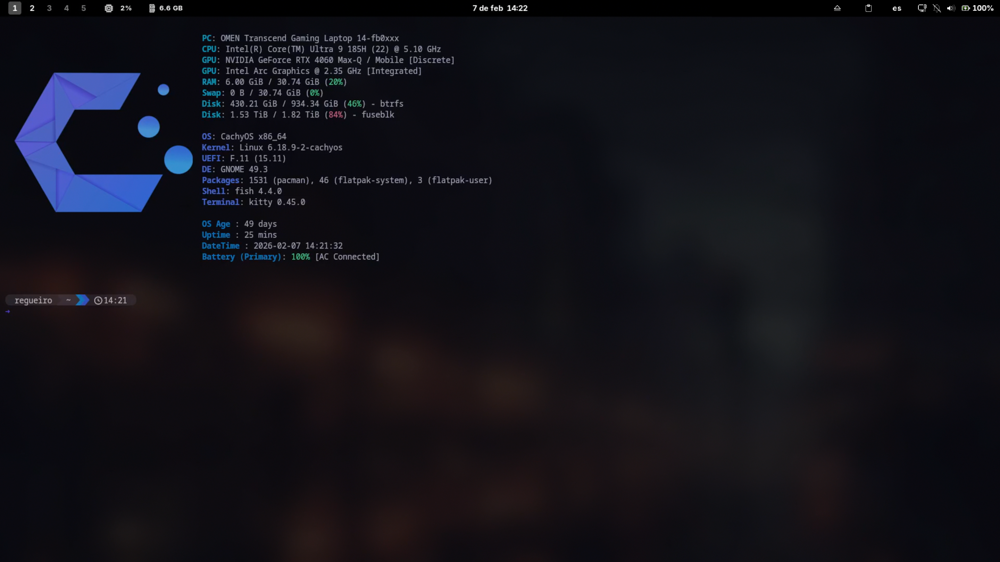
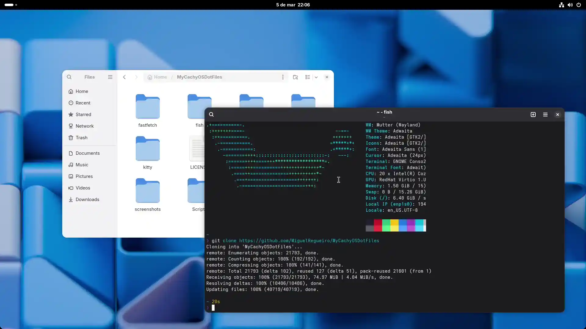
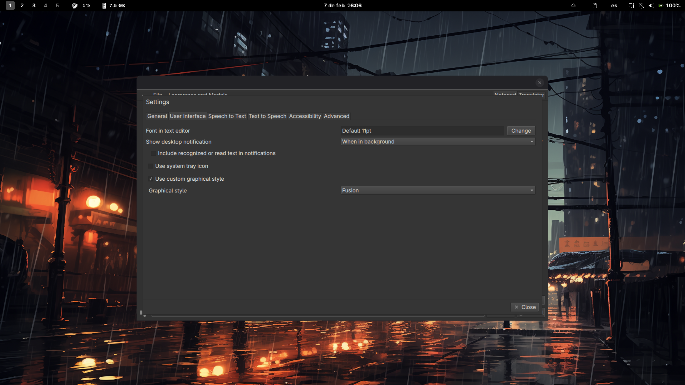

# 🚀 MyCachyOSDotFiles


<div align="center">




</div>

<br>

A CachyOS-focused GNOME dotfiles setup with a modular installer that automates desktop and system configuration, supporting **Arch-based** and **Fedora** systems.

Modules can be applied selectively, allowing you to install only the components you need.

---

## ✨ Features

- **Modular installer** with dry-run support
- **Automated GNOME desktop configuration** (workspaces, keybindings, themes)
- **GNOME extensions automation** (Blur My Shell, TopHat)
- **Terminal stack** (Kitty + Fish + Starship + Fastfetch)
- **Cross-distro installer support** (Arch-based + Fedora)
- **CachyOS-themed defaults** that can be customized (Fastfetch/logo)
- **Language/media workflow** (Japanese input via Anthy, MPV setup, optional Anki extras)
- **System tooling** (virtualization stack, media setup, developer utilities)
- **Safe to rerun** with backups and idempotent configuration

---

## 🚀 Install

Recommended:

```bash
git clone https://github.com/MiguelRegueiro/MyCachyOSDotFiles
cd MyCachyOSDotFiles
./Scripts/install.sh
```

Optional preview mode (no changes):

```bash
./Scripts/install.sh --dry-run
```

You can also run `./Scripts/install.sh` and choose dry-run in the guided wizard.

> The installer is the main entrypoint for this repo. Manual-only sections are documented below (for example Anki/SpeechNote tweaks, SSH aliases, system guides, and HP Omen notes).

<details>
<summary><strong>Common flags</strong></summary>

- `--yes` run non-interactive mode (auto-accept prompts)
- `--modules=base,gnome-core,flatpaks,...` run only selected modules
- `--preset=core` run `base,gnome-core,gnome-extensions,terminal,media`
- `--preset=full` run all modules
- `--skip-packages` skip distro package installation

Example:

```bash
./Scripts/install.sh --modules=base,terminal
```

</details>

### Installer Demo

<div align="center">

</div>

## 🧭 Installer Workflow (What It Does)

Done by installer: this section is applied by `./Scripts/install.sh`.

Execution order:

1. Detect distro and package mapping.
2. If no module/preset is provided, run guided setup (dry-run/packages/modules).
3. Resolve selected modules from wizard, `--modules`, or `--preset`.
4. Authenticate sudo once when root actions are needed.
5. Run selected modules (each module still has action-level confirmations unless auto-accepted).
6. Print final summary (completed/skipped/failed, module recap, action samples, and `User`/`Home`/log/backup paths).

### Modules

| Module | What it manages |
|---|---|
| `base` | user dirs, icons, wallpapers, optional themes, fonts, font cache |
| `gnome-core` | GNOME keybindings/workspaces/theme defaults/wallpaper |
| `gnome-extensions` | Extension Manager, extension install/enable (best effort when `gnome-extensions` CLI is unavailable), TopHat + Blur My Shell defaults |
| `terminal` | Fish/Kitty/Fastfetch/Starship config and helper CLI installs |
| `media` | media packages + MPV config |
| `flatpaks` | curated Flatpak app bundle from `Scripts/installer/data/flatpaks.txt` |
| `language` | IBus + Anthy setup (adds Japanese (Anthy) as an additional keyboard layout) |
| `virtualization` | QEMU/KVM + virt-manager + libvirt (optional groups/services/network actions, distro-aware service units) |

Notes:
- Curated Flatpak apps are managed by the `flatpaks` module.
- Legacy alias `--modules=gnome` maps to `gnome-core,gnome-extensions`.
- `virtualization` uses distro-aware libvirt activation (`libvirtd.socket` when available, otherwise modular sockets like `virtqemud.socket`) and uses `virsh -c qemu:///system` for network actions.

## 🔎 What Will Change On My System

At a glance:
- Writes GNOME `gsettings` for shortcuts/workspaces/theme/wallpaper.
- Installs distro packages depending on selected modules.
- Copies config/assets into user paths and creates timestamped backups.
- May install Flatpaks, Cargo crates, and pip user packages.

<details>
<summary><strong>Full gsettings keys touched</strong></summary>

When `gnome-core` actions are enabled, installer writes these keys:

- `org.gnome.desktop.wm.keybindings move-to-workspace-1`
- `org.gnome.desktop.wm.keybindings move-to-workspace-2`
- `org.gnome.desktop.wm.keybindings move-to-workspace-3`
- `org.gnome.desktop.wm.keybindings move-to-workspace-4`
- `org.gnome.desktop.wm.keybindings move-to-workspace-5`
- `org.gnome.desktop.wm.keybindings switch-to-workspace-1`
- `org.gnome.desktop.wm.keybindings switch-to-workspace-2`
- `org.gnome.desktop.wm.keybindings switch-to-workspace-3`
- `org.gnome.desktop.wm.keybindings switch-to-workspace-4`
- `org.gnome.desktop.wm.keybindings switch-to-workspace-5`
- `org.gnome.mutter dynamic-workspaces`
- `org.gnome.desktop.wm.preferences num-workspaces`
- `org.gnome.desktop.wm.keybindings switch-windows`
- `org.gnome.desktop.wm.keybindings switch-windows-backward`
- `org.gnome.desktop.wm.keybindings switch-applications`
- `org.gnome.desktop.wm.keybindings switch-applications-backward`
- `org.gnome.desktop.interface show-battery-percentage`
- `org.gnome.desktop.interface color-scheme`
- `org.gnome.desktop.interface cursor-theme`
- `org.gnome.desktop.interface icon-theme`
- `org.gnome.settings-daemon.plugins.media-keys custom-keybindings`
- `org.gnome.settings-daemon.plugins.media-keys.custom-keybinding:/org/gnome/settings-daemon/plugins/media-keys/custom-keybindings/custom0/ name`
- `org.gnome.settings-daemon.plugins.media-keys.custom-keybinding:/org/gnome/settings-daemon/plugins/media-keys/custom-keybindings/custom0/ command`
- `org.gnome.settings-daemon.plugins.media-keys.custom-keybinding:/org/gnome/settings-daemon/plugins/media-keys/custom-keybindings/custom0/ binding`
- `org.gnome.settings-daemon.plugins.media-keys.custom-keybinding:/org/gnome/settings-daemon/plugins/media-keys/custom-keybindings/custom1/ name`
- `org.gnome.settings-daemon.plugins.media-keys.custom-keybinding:/org/gnome/settings-daemon/plugins/media-keys/custom-keybindings/custom1/ command`
- `org.gnome.settings-daemon.plugins.media-keys.custom-keybinding:/org/gnome/settings-daemon/plugins/media-keys/custom-keybindings/custom1/ binding`
- `org.gnome.settings-daemon.plugins.media-keys.custom-keybinding:/org/gnome/settings-daemon/plugins/media-keys/custom-keybindings/custom2/ name`
- `org.gnome.settings-daemon.plugins.media-keys.custom-keybinding:/org/gnome/settings-daemon/plugins/media-keys/custom-keybindings/custom2/ command`
- `org.gnome.settings-daemon.plugins.media-keys.custom-keybinding:/org/gnome/settings-daemon/plugins/media-keys/custom-keybindings/custom2/ binding`
- `org.gnome.settings-daemon.plugins.media-keys.custom-keybinding:/org/gnome/settings-daemon/plugins/media-keys/custom-keybindings/custom3/ name`
- `org.gnome.settings-daemon.plugins.media-keys.custom-keybinding:/org/gnome/settings-daemon/plugins/media-keys/custom-keybindings/custom3/ command`
- `org.gnome.settings-daemon.plugins.media-keys.custom-keybinding:/org/gnome/settings-daemon/plugins/media-keys/custom-keybindings/custom3/ binding`
- `org.gnome.settings-daemon.plugins.media-keys.custom-keybinding:/org/gnome/settings-daemon/plugins/media-keys/custom-keybindings/custom4/ name`
- `org.gnome.settings-daemon.plugins.media-keys.custom-keybinding:/org/gnome/settings-daemon/plugins/media-keys/custom-keybindings/custom4/ command`
- `org.gnome.settings-daemon.plugins.media-keys.custom-keybinding:/org/gnome/settings-daemon/plugins/media-keys/custom-keybindings/custom4/ binding`
- `org.gnome.settings-daemon.plugins.media-keys.custom-keybinding:/org/gnome/settings-daemon/plugins/media-keys/custom-keybindings/custom5/ name`
- `org.gnome.settings-daemon.plugins.media-keys.custom-keybinding:/org/gnome/settings-daemon/plugins/media-keys/custom-keybindings/custom5/ command`
- `org.gnome.settings-daemon.plugins.media-keys.custom-keybinding:/org/gnome/settings-daemon/plugins/media-keys/custom-keybindings/custom5/ binding`
- `org.gnome.desktop.wm.keybindings close`
- `org.gnome.settings-daemon.plugins.media-keys shutdown`
- `org.gnome.settings-daemon.plugins.media-keys reboot`
- `org.gnome.desktop.background picture-uri`
- `org.gnome.desktop.background picture-uri-dark`

If `gnome-extensions` actions are enabled and extensions are installed, installer also tries:

- `org.gnome.shell.extensions.tophat position-in-panel`
- `org.gnome.shell.extensions.tophat cpu-display`
- `org.gnome.shell.extensions.tophat mem-display`
- `org.gnome.shell.extensions.tophat mem-abs-units`
- `org.gnome.shell.extensions.tophat show-disk`
- `org.gnome.shell.extensions.tophat show-fs`
- `org.gnome.shell.extensions.blur-my-shell.applications blur`
- `org.gnome.shell.extensions.blur-my-shell.applications enable-all`
- `org.gnome.shell.extensions.blur-my-shell.applications whitelist`
- `org.gnome.shell.extensions.blur-my-shell.applications dynamic-opacity`

</details>

### Keyboard shortcut mapping (`gnome-core`)

| Shortcut          | Application           | Command |
|-------------------|-----------------------|---------|
| `Super + 1..5`    | Switch workspace      | GNOME `switch-to-workspace-1..5` |
| `Shift + Super + 1..5` | Move window to workspace | GNOME `move-to-workspace-1..5` |
| `Super + E`       | Files (Nautilus)      | `nautilus --new-window` |
| `Super + Enter`   | Kitty Terminal        | `kitty` |
| `Super + R`       | Btop                  | `kitty -e btop` |
| `Super + B`       | Zen Browser           | `flatpak run app.zen_browser.zen` |
| `Super + F9`      | OCR (NormCap)         | `/usr/bin/flatpak run com.github.dynobo.normcap` |
| `Shift + Super + Enter` | runin (smart command launcher) | `kitty -e runin` |
| `Super + Q`       | Close Active Window   | Closes the currently focused window |
| `Shift + Super + L` | Shutdown            | GNOME media-keys `shutdown` action |
| `Shift + Super + P` | Reboot              | GNOME media-keys `reboot` action |

> [!TIP]
> - Alt+Tab is forced to window-switcher mode (window previews + icons) by setting `switch-windows` and clearing `switch-applications`/`switch-applications-backward`.
> - Workspaces are pinned to 5 static workspaces (`dynamic-workspaces=false`, `num-workspaces=5`).

### Packages installed (by module)

Package installation is optional in the wizard and can be disabled with `--skip-packages`.

<details>
<summary><strong>Full package matrix</strong></summary>

- `gnome-core`:
  - CachyOS/Arch: `gnome-tweaks`, `gnome-extensions-app`
  - Fedora/Nobara: `gnome-tweaks`, `gnome-extensions-app`
- `gnome-extensions`:
  - Flatpak app: `com.mattjakeman.ExtensionManager`
  - GNOME extensions from `Scripts/installer/data/gnome_extensions.txt`
  - GNOME extensions CLI dependency when needed:
    - CachyOS/Arch: `python-pipx`
    - Fedora/Nobara: `pipx`
- `terminal`:
  - CachyOS/Arch: `fish`, `kitty`, `fastfetch`, `fzf`, `btop`, `cargo`, `fd`
  - Fedora/Nobara: `fish`, `kitty`, `fastfetch`, `fzf`, `btop`, `cargo`, `fd-find`
  - Rust build deps for Cargo installs:
    - CachyOS/Arch: `openssl`, `pkgconf`, `base-devel`
    - Fedora/Nobara: `openssl-devel`, `pkgconf-pkg-config`, `gcc`, `make`
- `media`:
  - CachyOS/Arch: `mpv`, `ffmpeg`, `libva-utils`, `mesa-vdpau-drivers`, `libva-intel-driver`
  - Fedora/Nobara: `mpv`, `ffmpeg`, `libva-utils`, `libva-vdpau-driver`, `intel-media-driver`
- `flatpaks`:
  - Curated bundle from `Scripts/installer/data/flatpaks.txt`
- `language`:
  - CachyOS/Arch: `ibus`, `ibus-anthy`
  - Fedora/Nobara: `ibus`, `ibus-anthy`
  - Adds Japanese (`ibus`, `Anthy`) to GNOME input sources without replacing the primary layout
- `virtualization`:
  - CachyOS/Arch: `qemu-full`, `virt-manager`, `virt-viewer`, `dnsmasq`, `libguestfs`, `ebtables`, `vde2`, `openbsd-netcat`, `libvirt`, `edk2-ovmf`, `swtpm`
  - Fedora/Nobara: `@virtualization`, `virt-manager`, `virt-viewer`, `libvirt`, `swtpm`
- Flatpak support package (only if missing and Flatpak actions are selected):
  - CachyOS/Arch: `flatpak`
  - Fedora/Nobara: `flatpak`
- Flatpak apps installed by installer actions:
  - `com.mattjakeman.ExtensionManager` (`gnome-extensions` action)
  - Curated bundle from `Scripts/installer/data/flatpaks.txt` (`flatpaks` module)

</details>

### Files and paths touched

<details>
<summary><strong>Full files/paths impact</strong></summary>

- Creates/updates:
  - `~/.config`
  - `~/.local/share/icons`
  - `~/.local/share/fonts`
  - `~/Pictures/wallpapers`
  - `install.log` in repo root
- Copies repo assets/config into user paths:
  - `icons/*` -> `~/.local/share/icons/`
  - `wallpapers/*` -> `~/Pictures/wallpapers/`
  - `themes/*` -> `~/.themes/` (only if `themes/` exists in repo)
  - `Fonts/*` -> `~/.local/share/fonts/`
  - `fish/` -> `~/.config/fish/`
  - `kitty/` -> `~/.config/kitty/`
  - `fastfetch/` -> `~/.config/fastfetch/`
  - `starship.toml` -> `~/.config/starship.toml`
  - `mpv/` -> `~/.config/mpv/`
- Backs up overwritten targets under:
  - `~/.config-backups/mycachyosdotfiles_<timestamp>/...`
- May also modify:
  - `~/.local/bin/` (starship binary and helper symlinks such as `runin`, `cargo-install-update`, `fd`)
  - `~/.cargo/` (Cargo-installed binaries/crates)
  - `~/.local/share/gnome-shell/extensions/` (GNOME extension installs)
  - `/etc/shells` (adds fish path if missing)
  - User account shell (`chsh`)
  - User group membership (`usermod -aG ...` for available virtualization groups such as `libvirt`/`kvm`)
  - Libvirt service/socket enablement and default network state (may define `default` from `/usr/share/libvirt/networks/default.xml` when missing)

</details>

### Network Access (Installer)

<details>
<summary><strong>Show section</strong></summary>

The installer may use network access for enabled modules/actions:

- Distro package repos (`pacman` on Arch/CachyOS, `dnf` on Fedora/Nobara)
- Flathub (`flatpak remote-add`, `flatpak install`)
- Starship installer (`curl` from `starship.rs`)
- Cargo crates (`cargo install` for `cargo-update`, `runin`)
- PyPI (via `pipx install gnome-extensions-cli`)
- GNOME extension downloads (GNOME Shell D-Bus install or `gext`)

</details>

### Installer Re-run Behavior

<details>
<summary><strong>What happens when you run the installer again</strong></summary>

- Safe to re-run: **yes**.
- Package installs are usually no-op when already installed:
  - CachyOS/Arch: `pacman -S --needed`
  - Fedora/Nobara: `dnf install -y`
- GNOME settings are reapplied to the same values (`gsettings set`).
- Flatpak remotes are not duplicated (`--if-not-exists`).
- Config updates:
  - replace-style targets are backed up first (when they already exist), then replaced
  - merge-style copies (icons/wallpapers/themes/fonts) sync into destination without per-file snapshots
- If a replace-target does not exist yet (for example first run), there is nothing to snapshot for that target.

Expected effects each run:
- `install.log` is recreated.
- A new backup path is generated each run. The backup directory appears only when existing replace-targets are snapshotted.
- Network/install steps (`cargo`, `pip`, Flatpak, distro packages) may still download or update.
- `fc-cache -fv` and some service actions may run again even when already configured.

</details>

---

## 🧱 Manual Customization Reference

> [!NOTE]
> The following sections describe manual configuration steps that are **not managed by the installer**.

### Anki & SpeechNote

<details>
<summary><strong>Show section</strong></summary>

Optional extras (not installer-managed):

- Anki add-ons:
  1. Zoom for Anki 24 (`1923741581`)
  2. Review Heatmap (`1771074083`)
- SpeechNote voices:
  - Recommended: Kokoro `af_heart`
  - Voice list: https://huggingface.co/hexgrad/Kokoro-82M/blob/main/VOICES.md#american-english
  - Dark mode reference:
    

</details>

### SSH Aliases

<details>
<summary><strong>Show section</strong></summary>

SSH alias examples:

For Fish (`~/.config/fish/config.local.fish`):

```fish
abbr -a sshserver "ssh username@hostname"
```

For Bash (`~/.bashrc`):

```bash
alias sshserver='ssh username@hostname'
source ~/.bashrc
```

Optional (personal workflow): I also use [SSH Watchdog](https://extensions.gnome.org/extension/9343/ssh-watchdog/) (a small GNOME extension I made) to monitor/manage SSH sessions in GNOME Shell.

</details>


## 🛠️ System Guides

### Swap Usage Troubleshooting (Swappiness)

<details>
<summary><strong>Show section</strong></summary>

Swappiness (recommended for high-RAM systems):

1. Check current value: `sysctl vm.swappiness`
2. Set in `/etc/sysctl.conf`: `vm.swappiness = 10`
3. Apply: `sudo sysctl -p`
4. Verify: `cat /proc/sys/vm/swappiness`

Performance tools:
- MangoHud: `MANGOHUD=1`
- Steam launch option: `MANGOHUD=1 gamemoderun %command%`
- Btop: install with your distro package manager (`btop` package)

</details>

### External Gaming Drive Setup (Windows NTFS)

<details>
<summary><strong>Show section</strong></summary>

External NTFS game drive (Windows-formatted):

1. Find UUID: `sudo blkid`
2. Create mount point: `sudo mkdir -p /mnt/gamedrive`
3. Add to `/etc/fstab`:
   ```
   UUID=YOUR_UUID_HERE  /mnt/gamedrive  ntfs-3g  uid=1000,gid=1000,rw,exec,umask=000,nofail,x-gvfs-show  0  0
   ```

</details>


## 🎮 HP Omen

<details>
<summary><strong>Show section</strong></summary>

This uses the `hp-omen-linux-module` workflow for keyboard RGB control.

1. Clone:
   ```bash
   git clone https://github.com/ranisalt/hp-omen-linux-module
   cd hp-omen-linux-module
   ```
2. Switch to a compatible branch (example): `git checkout rebase-6.15`
3. Install via DKMS:
   ```bash
   sudo dkms remove hp-omen-wmi/0.6.2 --all
   sudo dkms add .
   sudo dkms build hp-omen-wmi/0.6.15
   sudo dkms install hp-omen-wmi/0.6.15
   ```
4. Reload module and verify zones:
   ```bash
   sudo modprobe -r hp-wmi && sudo modprobe hp-wmi
   ls -la /sys/devices/platform/hp-wmi/rgb_zones/
   ```
5. Write color values:
   - Example: `sudo bash -c 'echo 3835ff > /sys/devices/platform/hp-wmi/rgb_zones/zone00'`

Included helper script:

```bash
./Scripts/set_omen_colors_blue.sh
```

</details>

---

## ℹ️ Usage & Maintenance

### How to Use This Repo

1. Use `./Scripts/install.sh` as the single entrypoint.
2. Use `--dry-run` to force preview mode (or choose dry-run in the guided wizard).
3. Re-run installer anytime; existing config is backed up before overwrite.
4. For manual-only items, see **Manual Customization Reference** and **System Guides**.

Compatibility notes:
- These configs are CachyOS-focused, but installer logic supports Arch-based and Fedora systems.
- Some parts may require extra packages such as `ntfs-3g`, `gamemode`, or `mangohud`.

### Backup & Restore

Installer summary output at end of run includes:
- Status counts: `completed`, `skipped`, `failed`
- Module recap: completed/skipped modules (and rerun hint for skipped modules)
- Sample lists of failed/completed/skipped actions
- Fish shell change note (when applicable)
- Paths/context:
  - `User`
  - `Home`
  - `Log file`
  - `Backup dir`

Installer behavior:
- `install.log` is written at repo root and recreated each run.
- Each installer run generates a timestamped backup path:
  - `~/.config-backups/mycachyosdotfiles_<timestamp>/`
  - backup directory appears only when something is actually backed up
- Backups include existing targets before replacement actions (for example `~/.config/fish`, `~/.config/kitty`, `~/.config/fastfetch`, `~/.config/mpv`, `~/.config/starship.toml`).
- Merge-copy actions (icons/wallpapers/themes/fonts) sync files in place and do not create per-file backups.

Restore examples:

```bash
# Pick the most recent installer backup (or set this manually)
BACKUP_DIR="$(ls -dt "$HOME"/.config-backups/mycachyosdotfiles_* | head -n1)"

# Restore one config
cp -a "$BACKUP_DIR/.config/fish" "$HOME/.config/fish"

# Restore everything from a specific backup snapshot (review before running)
cp -a "$BACKUP_DIR"/. "$HOME"/
```

## 📄 License & Third-Party Assets

- Repo-level configuration/scripts are licensed under [LICENSE](LICENSE).
- Bundled third-party assets (fonts/icons/wallpapers/logos) may use different licenses, and upstream notices are preserved (for example `icons/MacTahoe/COPYING` and `icons/MacTahoe/AUTHORS`).
