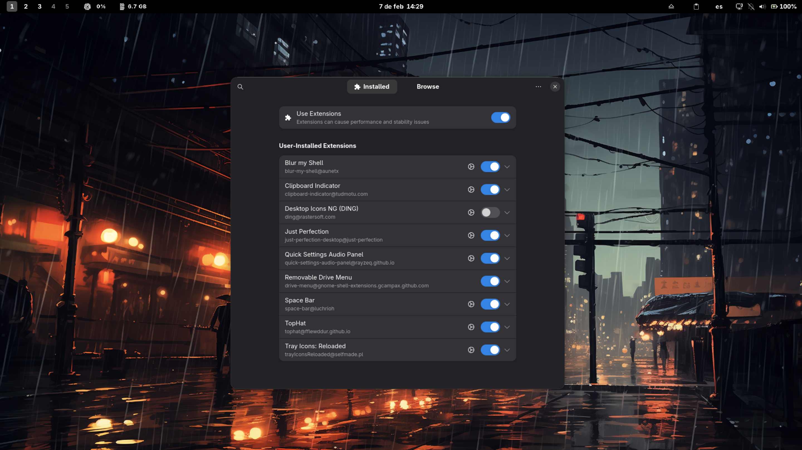
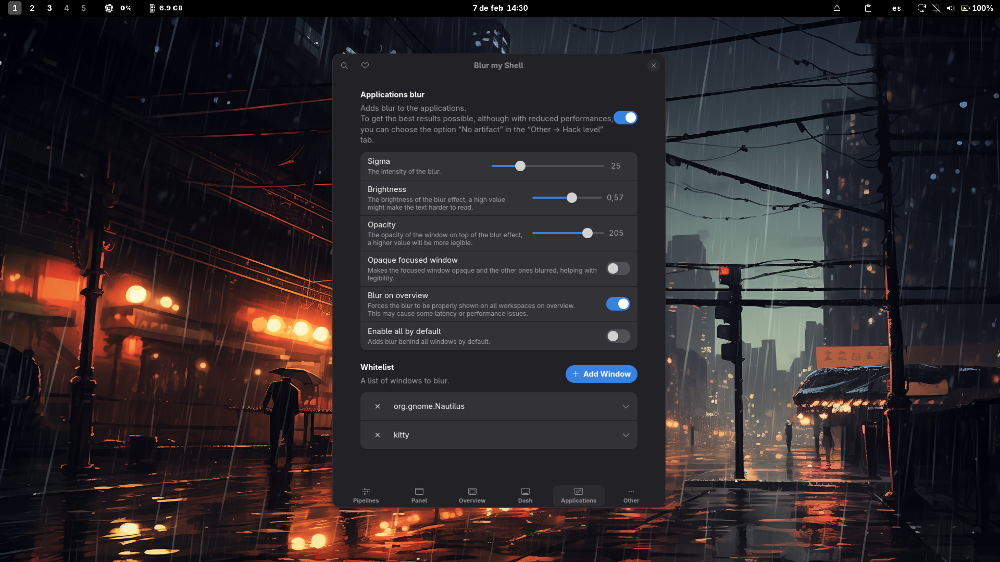

# 🚀 MyCachyOSDotFiles

<div align="center">


</div>

<br>

Custom dotfiles and system tweaks for CachyOS (Arch-based).

This setup is tailored for CachyOS, but many parts work on other Arch-based systems and GNOME setups.

---

## 📖 Table of Contents

- [🚀 Quick Start](#-quick-start)
- [🧱 Base](#-base)
  - [GNOME Desktop Environment](#gnome-desktop-environment)
  - [Terminal & CLI Tools](#terminal--cli-tools)
  - [Software & Applications](#software--applications)
  - [Connectivity](#connectivity)
- [🟦 CachyOS](#-cachyos)
  - [System Optimization & Monitoring](#system-optimization--monitoring)
  - [Hardware & Storage](#hardware--storage)
- [🎮 HP Omen](#-hp-omen)
- [ℹ️ Reference](#-reference)
  - [License & Third-Party Assets](#-license--third-party-assets)

---

## 🚀 Quick Start

Get up and running quickly with these steps.

Recommended (guided installer; run and choose what to apply):

```bash
./Scripts/install.sh
```

For test/preview mode (no changes):

```bash
./Scripts/install.sh --dry-run
```

1. Clone the repository:
   ```bash
   git clone https://github.com/MiguelRegueiro/MyCachyOSDotFiles
   cd MyCachyOSDotFiles
   ```

2. Install prerequisite tools:
   ```bash
   sudo pacman -S gnome-tweaks
   ```

3. Run the automated GNOME shortcut script:
   ```bash
   ./Scripts/set_window_workspace_shortcuts.sh
   ```

4. Install themes and icons:
   ```bash
   mkdir -p ~/.local/share/icons
   cp -r icons/* ~/.local/share/icons/
   ```

5. Copy configuration files:
   ```bash
   cp -r kitty/ ~/.config/
   cp -r fish/ ~/.config/
   cp -r fastfetch/ ~/.config/
   cp starship.toml ~/.config/
   cp -r mpv/ ~/.config/
   ```

---

## 🧱 Base

### GNOME Desktop Environment

<details>
<summary><strong>Show section</strong></summary>

Use the automation script:

```bash
./Scripts/set_window_workspace_shortcuts.sh
```

It configures:
- Traditional Alt+Tab behavior (windows, not app groups)
- Battery percentage in top bar
- Workspace shortcuts (`Super+1-5`, `Super+Shift+1-5`)
- App launchers (`Super+E`, `Super+Enter`, etc.)
- `Super+Q` for close-window

Manual `gsettings` (optional):

```bash
gsettings set org.gnome.desktop.wm.keybindings switch-windows "['<Alt>Tab']"
gsettings set org.gnome.desktop.wm.keybindings switch-windows-backward "['<Shift><Alt>Tab']"
gsettings set org.gnome.desktop.wm.keybindings switch-applications "[]"
gsettings set org.gnome.desktop.wm.keybindings switch-applications-backward "[]"
gsettings set org.gnome.desktop.interface show-battery-percentage true
```

Shortcut mapping used:

| Shortcut       | Application          | Command |
|----------------|----------------------|---------|
| `Super + E`    | Files (Nautilus)     | `nautilus --new-window` |
| `Super + Enter`| Kitty Terminal       | `kitty` |
| `Super + R`    | Btop                 | `kitty -e btop` |
| `Super + B`    | Zen Browser          | `flatpak run app.zen_browser.zen` |
| `Super + F9`   | OCR (NormCap)        | `/usr/bin/flatpak run com.github.dynobo.normcap` |
| `Super + Q`    | Close Active Window  | Closes the currently focused window |

Visual style:

1. Install `gnome-tweaks`:
   ```bash
   sudo pacman -S gnome-tweaks
   ```
2. Enable the **User Themes** extension in `gnome-extensions-app`.
3. Optional: add GNOME extension UUIDs (one per line) in `Scripts/installer/data/gnome_extensions.txt`; the installer can install/enable them.

Included themes (`icons/`):

| Component  | Theme                 | Installation |
| ---------- | --------------------- | ------------ |
| Icon Theme | MacTahoe              | Copy to `~/.local/share/icons/` |
| Cursor     | Bibata-Modern-Classic | Copy to `~/.local/share/icons/` |

Install icons:

```bash
cp -r icons/* ~/.local/share/icons/
```

Install fonts:

```bash
mkdir -p ~/.local/share/fonts
cp -r Fonts/* ~/.local/share/fonts/
fc-cache -fv
```

Included fonts:
- `Kaiti.ttf` and `yumin.ttf` (language learning)
- `Fonts/NerdFonts/*` (terminal)

Wallpaper:
- Default: `wallpapers/background`
- Set via desktop context menu (“Change Background”)

GNOME extensions / Blur My Shell preview:

<div align="center">
  
  
</div>

</details>

### Terminal & CLI Tools

<details>
<summary><strong>Show section</strong></summary>

This setup uses Kitty + Fish + Starship + Fastfetch.

- Kitty
  - Config: `~/.config/kitty/kitty.conf`
  - Highlights: Wayland support, transparency/blur, borderless window, font resize shortcuts
- Fish
  - Install: `sudo pacman -S fish`
  - Set default shell: `chsh -s /usr/bin/fish`
  - Config: `~/.config/fish/config.fish`
  - Includes `fzf` key bindings and `up` abbreviation
  - Rust CLI updater used by `up`: `cargo install cargo-update` (adds `cargo install-update -a` to update installed Cargo binaries in one command)
- Starship
  - Install: `curl -sS https://starship.rs/install.sh | sh`
  - Config: `~/.config/starship.toml`
- Fastfetch
  - Install: `sudo pacman -S fastfetch`
  - Config: `~/.config/fastfetch/config.jsonc`

</details>

### Software & Applications

<details>
<summary><strong>Show section</strong></summary>

Virtualization (QEMU/KVM):

1. Install packages:
   ```bash
   sudo pacman -S qemu-full virt-manager virt-viewer dnsmasq libguestfs ebtables vde2 openbsd-netcat libvirt edk2-ovmf swtpm
   ```
2. Add your user to groups:
   ```bash
   sudo usermod -aG libvirt,kvm $USER
   ```
3. Enable services:
   ```bash
   sudo systemctl enable --now libvirtd.socket
   sudo systemctl enable --now libvirtd.service
   ```
4. Configure default network:
   ```bash
   sudo virsh net-autostart default
   sudo virsh net-start default
   ```
5. Verify in Virt-Manager.

Utilities, media, language:

- NormCap (OCR)
  - Install: `flatpak install flathub com.github.dynobo.normcap`
  - Launch shortcut in this setup: `Super+F9`
- MPV immersion config
  - Install dependencies:
    ```bash
    sudo pacman -S mpv ffmpeg
    sudo pacman -S libva-intel-driver libva-utils mesa-vdpau-drivers
    ```
  - Copy config:
    ```bash
    cp -r mpv/ ~/.config/
    ```
- Japanese input (IBus + Anthy)
  - Install: `sudo pacman -S ibus-anthy ibus`
  - Add method in `ibus-setup`
  - Start daemon: `ibus-daemon -drx`

Other Flatpaks:

```bash
flatpak install flathub net.ankiweb.Anki app.zen_browser.zen net.mkiol.SpeechNote org.qbittorrent.qBittorrent
```

Optional extras:

- Anki add-ons:
  1. Zoom for Anki 24 (`1923741581`)
  2. Review Heatmap (`1771074083`)
- SpeechNote voices:
  - Recommended: Kokoro `af_heart`
  - Voice list: https://huggingface.co/hexgrad/Kokoro-82M/blob/main/VOICES.md#american-english
  - Dark mode reference:
    

</details>

### Connectivity

<details>
<summary><strong>Show section</strong></summary>

SSH alias examples:

For Fish (`~/.config/fish/config.local.fish`):

```fish
abbr -a sshserver "ssh username@hostname"
```

For Bash (`~/.bashrc`):

```bash
alias sshserver='ssh username@hostname'
source ~/.bashrc
```

Optional (personal workflow): I also use [SSH Watchdog](https://extensions.gnome.org/extension/9343/ssh-watchdog/) (a small GNOME extension I made) to monitor/manage SSH sessions in GNOME Shell.

</details>

---

## 🟦 CachyOS

### System Optimization & Monitoring

<details>
<summary><strong>Show section</strong></summary>

Swappiness (recommended for high-RAM systems):

1. Check current value: `sysctl vm.swappiness`
2. Set in `/etc/sysctl.conf`: `vm.swappiness = 10`
3. Apply: `sudo sysctl -p`
4. Verify: `cat /proc/sys/vm/swappiness`

Performance tools:
- MangoHud: `MANGOHUD=1`
- Steam launch option: `MANGOHUD=1 gamemoderun %command%`
- Btop install: `sudo pacman -S btop`

</details>

### Hardware & Storage

<details>
<summary><strong>Show section</strong></summary>

External NTFS game drive:

1. Find UUID: `sudo blkid`
2. Create mount point: `sudo mkdir -p /mnt/gamedrive`
3. Add to `/etc/fstab`:
   ```
   UUID=YOUR_UUID_HERE  /mnt/gamedrive  ntfs-3g  uid=1000,gid=1000,rw,exec,umask=000,nofail,x-gvfs-show  0  0
   ```

</details>

---

## 🎮 HP Omen

<details>
<summary><strong>Show section</strong></summary>

This uses the `hp-omen-linux-module` workflow for keyboard RGB control.

1. Clone:
   ```bash
   git clone https://github.com/ranisalt/hp-omen-linux-module
   cd hp-omen-linux-module
   ```
2. Switch to a compatible branch (example): `git checkout rebase-6.15`
3. Install via DKMS:
   ```bash
   sudo dkms remove hp-omen-wmi/0.6.2 --all
   sudo dkms add .
   sudo dkms build hp-omen-wmi/0.6.15
   sudo dkms install hp-omen-wmi/0.6.15
   ```
4. Reload module and verify zones:
   ```bash
   sudo modprobe -r hp-wmi && sudo modprobe hp-wmi
   ls -la /sys/devices/platform/hp-wmi/rgb_zones/
   ```
5. Write color values:
   - Example: `sudo bash -c 'echo 3835ff > /sys/devices/platform/hp-wmi/rgb_zones/zone00'`

Included helper script:

```bash
./Scripts/set_omen_colors_blue.sh
```

</details>

---

## ℹ️ Reference

### How to Use This Repo

1. Clone: `git clone https://github.com/MiguelRegueiro/MyCachyOSDotFiles`
2. Copy desired configs to `~/.config/` based on the section you want (`Base`, `CachyOS`, `HP Omen`).
3. Keep private values local (for example personal SSH aliases) instead of committing them.
4. Apply GNOME settings using scripts or manual commands.
5. Install only the tools you need.

### 📄 License & Third-Party Assets

- Repo-level configuration/scripts are licensed under [LICENSE](LICENSE).
- Third-party bundled assets (fonts/icons/wallpapers/logos) may use different licenses.
- Third-party assets are not claimed as repository-authored work.
- Upstream notices bundled with themes are preserved (for example `icons/MacTahoe/COPYING` and `icons/MacTahoe/AUTHORS`).

### Notes & Compatibility

- These configs were built for CachyOS but many parts work on other Arch-based, systemd distros using GNOME.
- Some parts may require extra packages such as `ntfs-3g`, `gamemode`, or `mangohud`.
